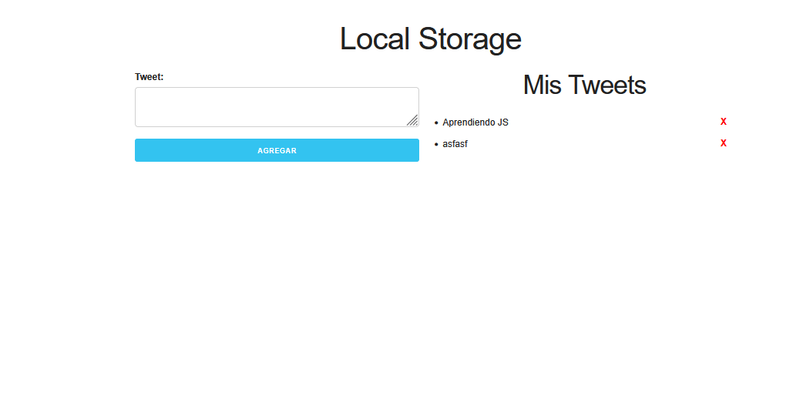

# Local Storage con simulador de tweets

Esta es una aplicacion para practicar el Local Storage dentro de Javascript, se desarrollo una interfaz sencilla, la cual simula la creacion de tweets y 
la persistencia de estos dentro del almancenamiento local del navegador. 

## Screenshots

## Tech Stack

Frontend: Javascript, CSS y HTML
